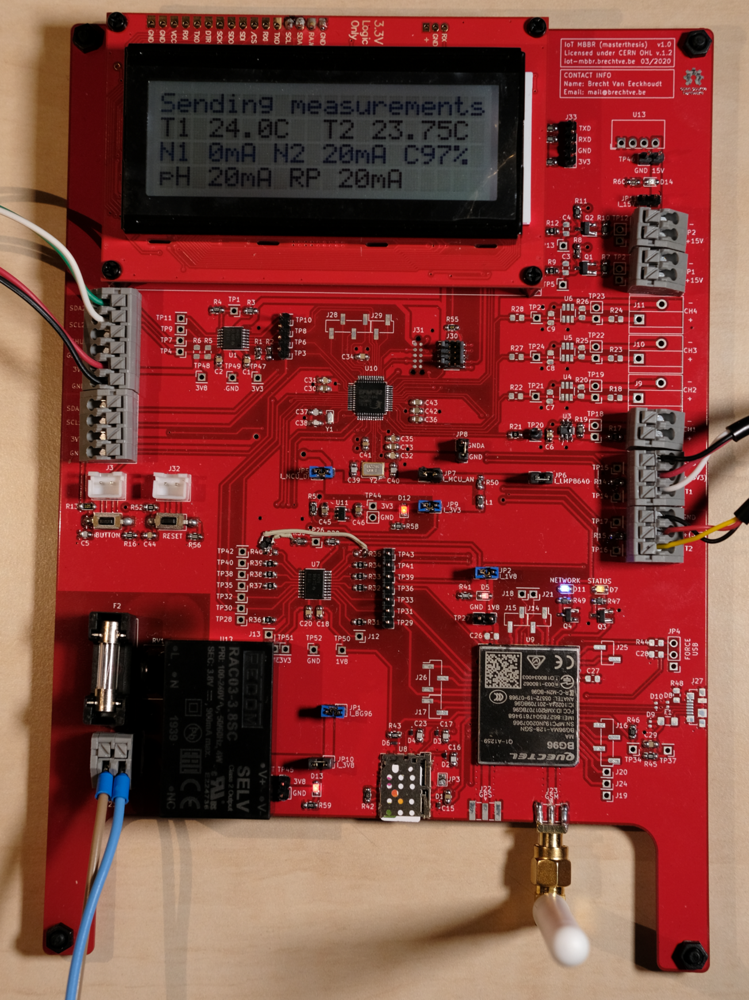
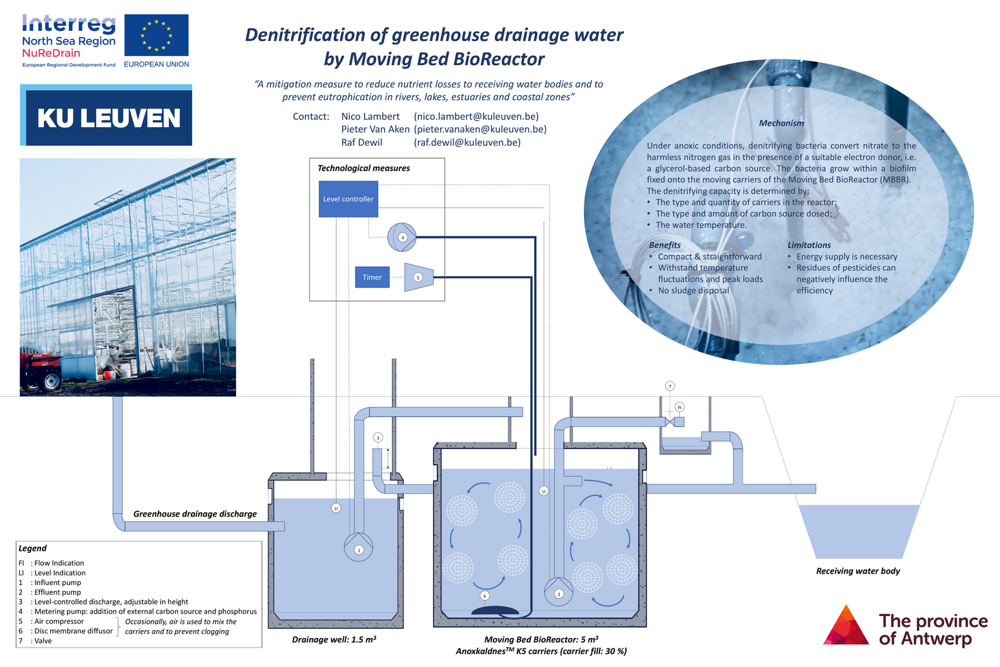
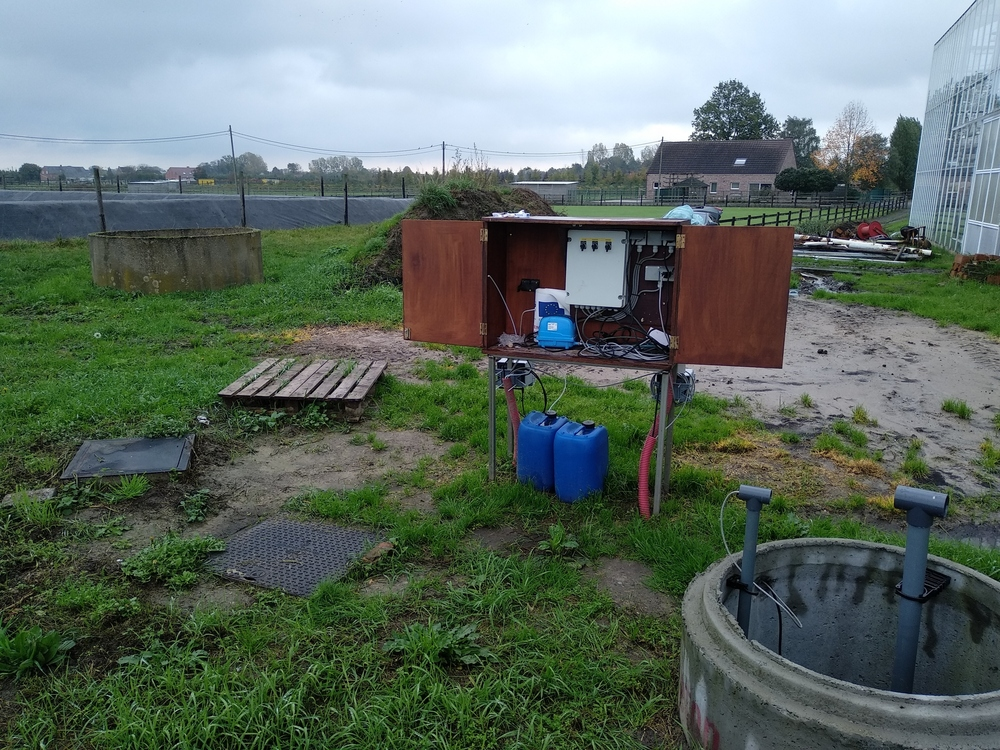
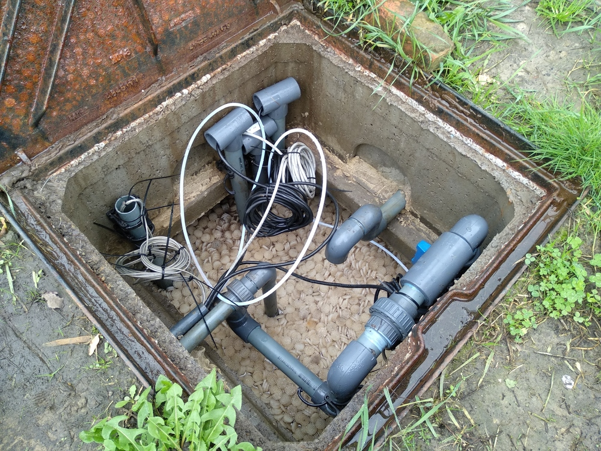
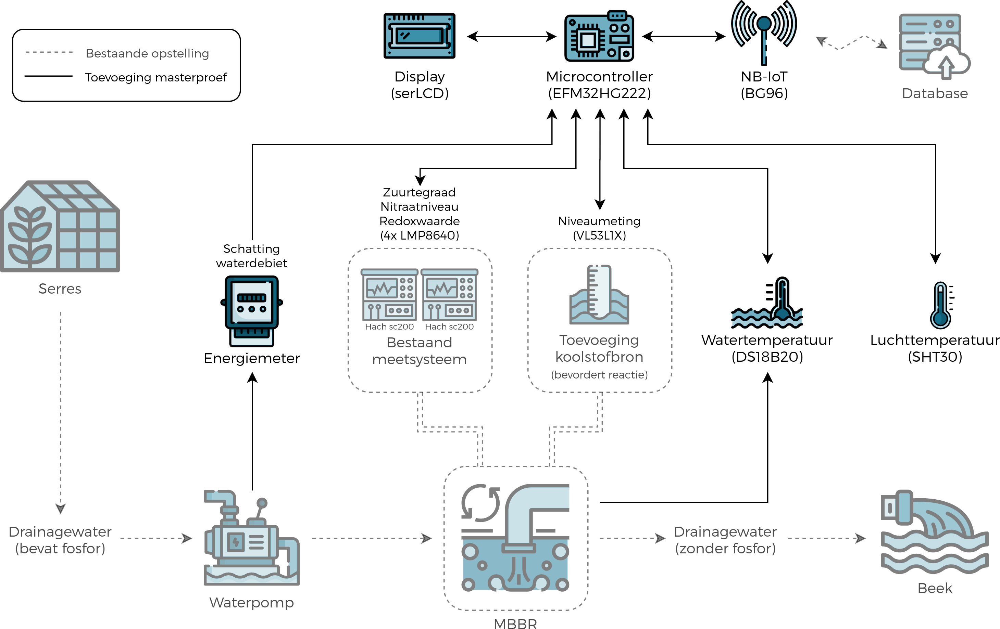
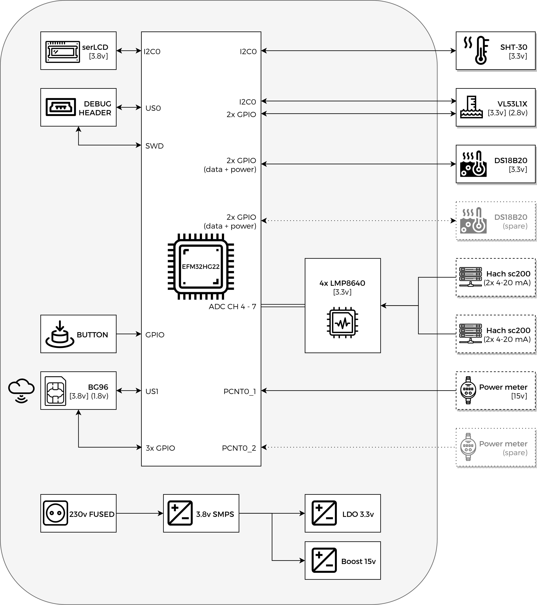
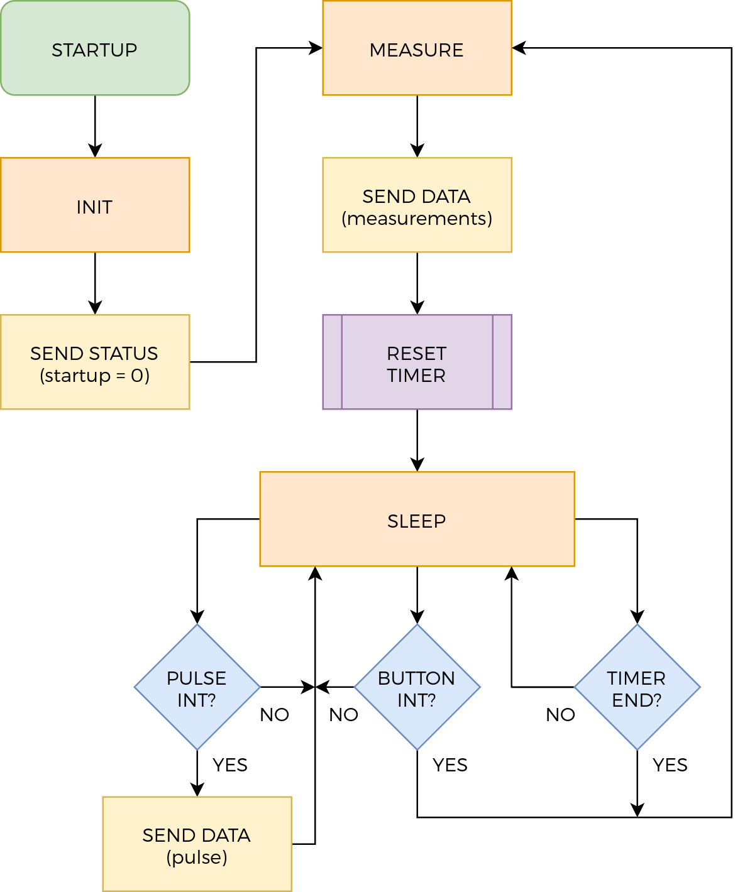
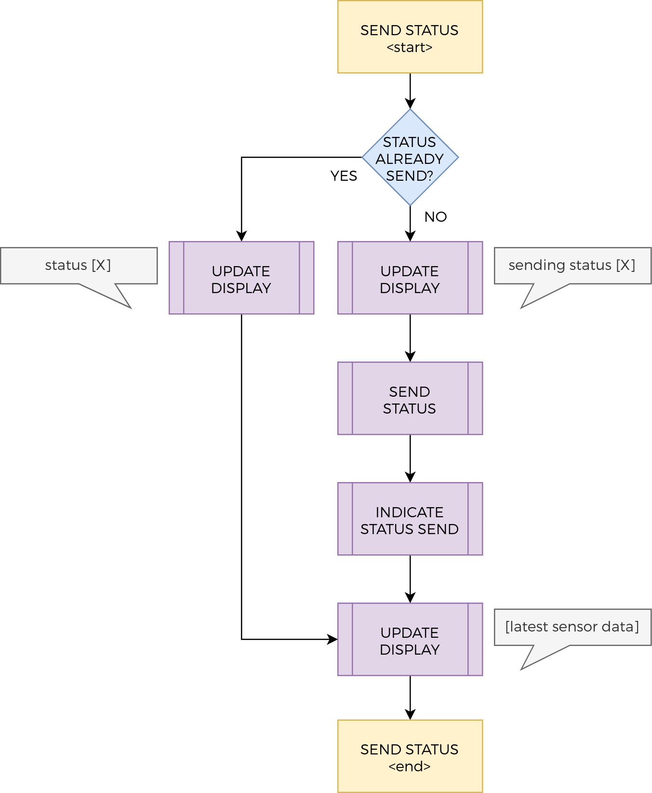
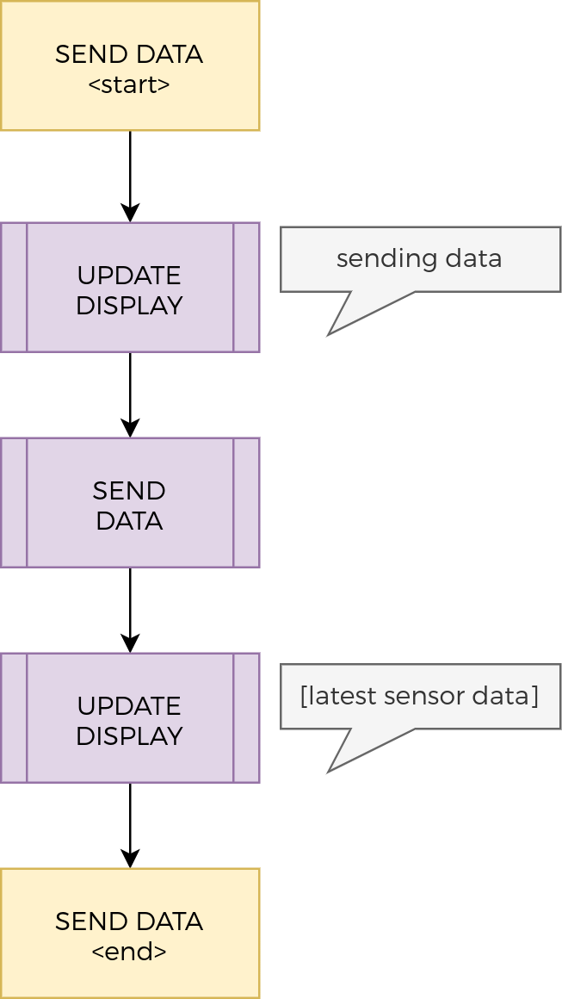
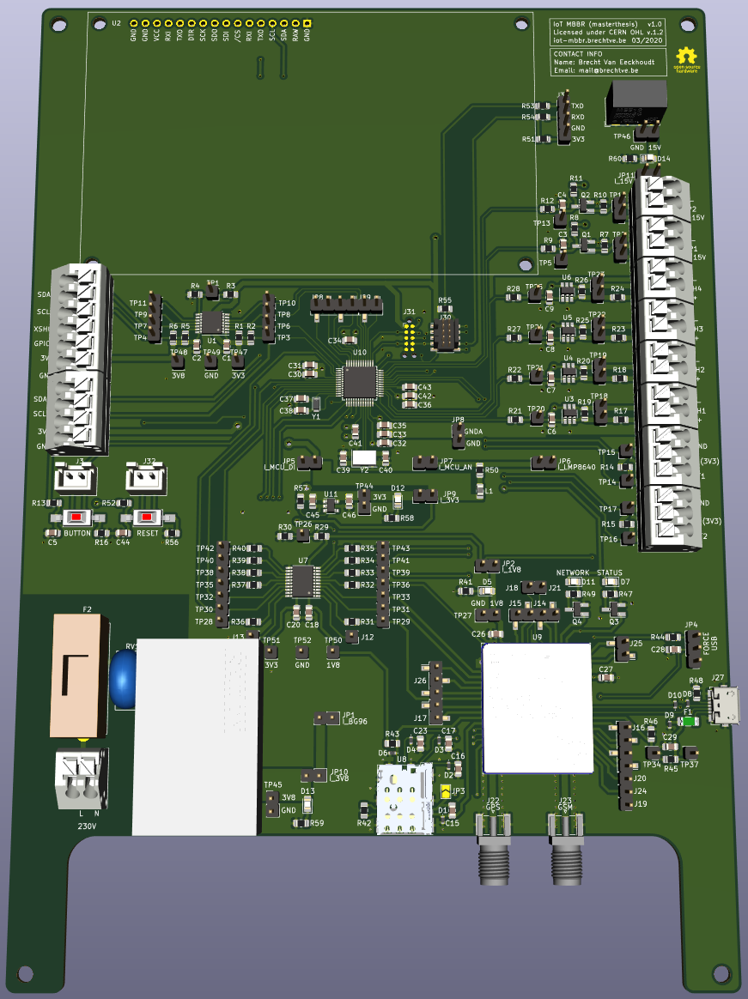

# Masterthesis

 

 

| Quick access links | |
|------|-----|
| [PCB v1.0 schematic (PDF)](hardware/masterthesis-hardware/Plots/masterthesis-hardware-v1.0.pdf) | [Doxygen code documentation of individual files and methods](https://fescron.github.io/masterthesis/files.html) |
| [PCB v1.0 layout (PDF)](hardware/masterthesis-hardware/Plots/masterthesis-hardware-v1-0-PCB.pdf) | [Doxygen TODO's](https://fescron.github.io/masterthesis/todo.html) |

 

This repository is a collection of hardware, firmware and some documentation files for the project I created for my masterthesis.

 

## 0 - Table of Contents

- [Masterthesis](#masterthesis)
  - [0 - Table of Contents](#0---table-of-contents)
  - [1 - Situation](#1---situation)
  - [2 - Hardware](#2---hardware)
  - [3 - Firmware](#3---firmware)
  - [4 - Additional hardware changes (PCB v1.0)](#4---additional-hardware-changes-pcb-v10)

 

## 1 - Situation

The goal of the thesis was to create a module to connect a *Moving Bed BioReactor* (MBBR, schematically pictured below) to the Cloud. A MBBR is a system which removes excess nitrites in, in this case, drainwater coming from greenhouses to prevent eutrophication in surrounding water bodies. This is done by denitrifying bacteria inside the bioreactor, which grow on moving plastic *carriers*, and convert the nitrate to nitrogen gas. This is done in anoxic conditions and in the presence of a suitable electron donor, such as a glycerol-based carbon source.

 

The picture below on the left gives an overview of the system that has already been build on the location. The drainage well from the diagram above is pictured on the lower right of this picture. The MBBR itself and a smaller drainage well are underground, under the two manhole covers on the left. In the middle of the picture the measuring system is visible, with under it two blue barrels of carbon source. The picture below on the right gives a peek inside the MBBR. The plastic *carries* are clearly visible.

 

 

To get an overview of the added components of the masterthesis (in full-color) in relation to the already existing structures (semi-transparant), a global block diagram (in Dutch) was created which can be seen below.

 

The heart of the project is the *EFM32HG222* microcontroller and with a Sparkfun *SerLCD* display it is possible to display status information and measurements. The IoT connection is done with a *BG96* modem over NB-IoT. To get an indication of the amount of water processed by the MBBR, the amount of energy used by the waterpump is monitored with an energy-meter. This gives a pulse to the microcontroller when a certain amount of energy is used. Measurements done by the MBBR system (Hach *sc200*: acidity level, nitrate value, redox value) are acquired via *4-20 mA current loops*. The remaining amount of carbon source in a barrel is measured with a *VL53L1X* sensor. To measure the water temperature a *DS18B20* sensor was chosen, and to get the air temperature (and humidity) a *SHT30* sensor is used.

 

## 2 - Hardware

Below one can see the block diagram of the constructed PCB (inside the big grey rounded rectangle) and the external sensors/modules on the far right. Semi-transparent items are optional for future expansion. The voltages used by the different components are indicated in square brackets. The different interconnecting technologies (I2C, USART, SWD, ADC, GPIO, ...) are indicated inside the MCU block.

 

230v mains power is used to power the project. A big SMPS is used to convert this AC voltage to a 3.8v DC voltage, mainly to power the BG96 modem and the display. The logic interfaces of the modem however run on 1.8v (indicated by the rounded brackets), so a level-shifter is used to convert the 3.3v logic signals from the MCU. The 3.8v voltage is then further stepped down to 3.3V using an LDO, for use by the MCU and temperature sensors. A 15V boostconverter is also added to supply power to the energy-meter. The schematic of the project can be found [here](hardware/masterthesis-hardware/Plots/masterthesis-hardware-v1.0.pdf).

 

## 3 - Firmware

To get a better idea of the code functionality a few flowcharts were designed, which can be seen below. The left most diagram indicates the *main code-flow*. The code-flow inside the yellow frames on this main flowchart are elaborated in the two diagrams next to the main diagram. The middle flowchart indicates how different statuses are send to the cloud, and the right one indicates how data is being send to the cloud.

  

 

When starting up the code first initializes all the peripherals (INIT). After this a status message is send (SEND STATUS) indicating that the module started up. It can be noted that there is functionality to make sure the module doesn't *spam* status messages, which can be seen in the middle flowchart. Before sending the status message the display is updated indicating that a status message is being send. After the message has been send to the cloud the display is updated with the latest measurements.

After the startup message has been send new measurements are taken (MEASURE), and subsequently these are send to the cloud (SEND DATA). Prior to sending this data the display is updated with a message that data is being send. Afterwards the new measurements are shown on the display. When all of this is done the internal timer is reset (RESET TIMER) so the module can go back to sleep (SLEEP) and wake up after a predefined amount of time (TIMER END) to take new measurements. The module can also wake up on a button press (BUTTON INT) or on an incoming pulse from the energy meter (PULS INT). If the latter is the case this is directly send to the cloud (SEND DATA).

 

## 4 - Additional hardware changes (PCB v1.0)

Even though a lot of time was spend making sure the schematic was correct a bodge had to be made to make sure the modem could be turned correctly on and off with the `PWRKEY` pin. At first this was supposed to be done with the `TXB0108PWR` levelshifter but it turned out this could not work due to the inner workings of this chip. Luckily a lot of testpads and zero-ohm resistors were included in the design and a MOSFET, resistor and bodge-wire could easily be soldered to enable the correct functionality. This can be seen on the first overview picture on this repository.

What can also be seen on this picture is that not all of the components are fitted. Some were not soldered because they were not necessary at that point, like for example the micro-USB port which can be used for firmware updates and configuration of the modem. A 3D-render of the whole project is however given below, only missing the display and surrounding case.

